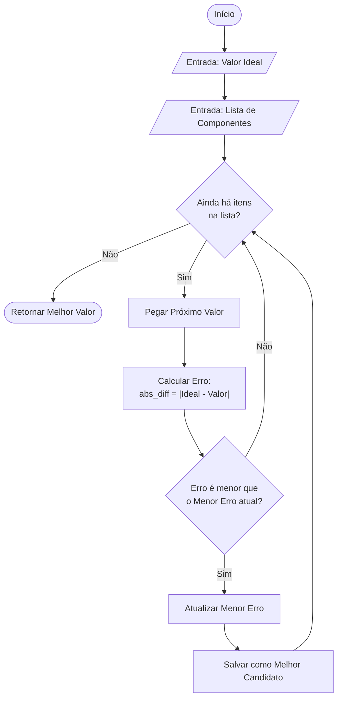
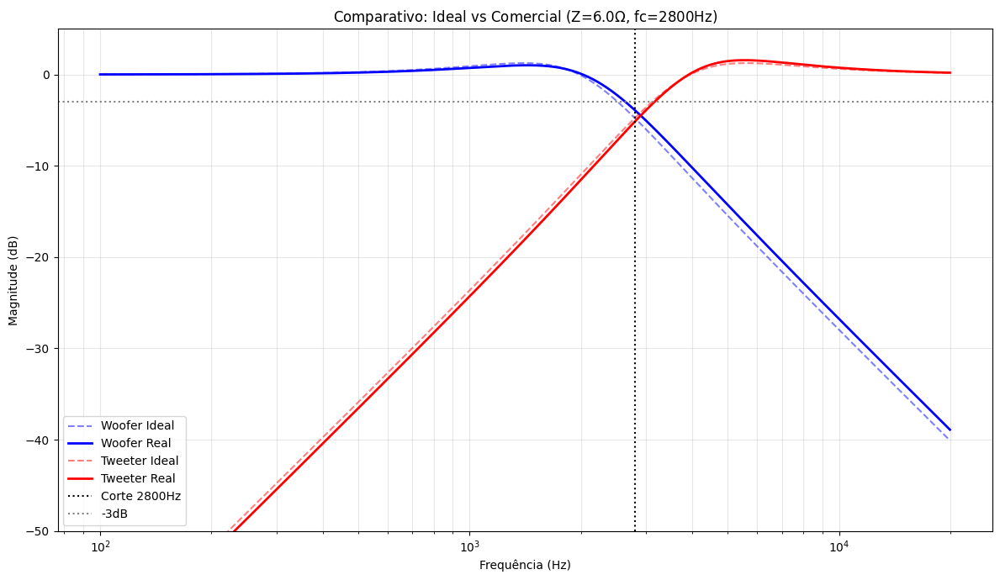

# Projeto: Crossover Passivo 

**Autor:** Keila Dario
**Disciplina:** Circuitos de Corrente Alternada


## 1. Introdução
O Crossover passivo vem com o objetivo de filtrar frequências para separar o sinal de áudio, utilizando componentes eletrônicos passivos (capacitores e indutores) para realizar a filtragem.

Neste projeto, o foco é o desenvolvimento de um sistema "2-vias" composto por um **Tweeter** (frequências altas) e um **Woofer** (frequências baixas). Os parâmetros de entrada definidos para o projeto foram:
* **Impedância de Carga:** 6 Ohms
* **Frequência de Corte:** 2,8 kHz

Com essas informações, é possível calcular os valores ideais dos componentes. No entanto, para tornar o projeto viável fisicamente, implementamos uma solução em Python que não apenas calcula o ideal, mas busca os componentes comerciais mais próximos no mercado, gerando um gráfico de Bode para análise comparativa entre a teoria e a realidade.

## 2. Metodologia de Projeto

### Fórmulas Utilizadas
As funções de transferência baseiam-se no cálculo da reatância para a frequência de corte ($f_c$) desejada.

**Para o filtro Passa-Baixa (Woofer):**
$$L = \frac{Z \cdot \sqrt{2}}{2 \pi f_c}$$
$$C = \frac{1}{2 \pi f_c \cdot Z \cdot \sqrt{2}}$$

**Para o filtro Passa-Alta (Tweeter):**
$$C = \frac{1}{2 \pi f_c \cdot Z \cdot \sqrt{2}}$$
$$L = \frac{Z \cdot \sqrt{2}}{2 \pi f_c}$$

### Lógica de Seleção (Algoritmo nearest)

Para solucionar o problema da discretização dos componentes, foi implementado um algoritmo de busca linear de minimização de erro.

A função **nearest** opera seguindo os seguintes passos lógicos:

1.  **Entrada:** Recebe o valor ideal calculado ($V_{ideal}$) e a lista de valores comerciais padronizados;
2.  **Varredura:** O algoritmo itera sobre cada componente disponível na lista comercial;
3.  **Cálculo do Erro:** Para cada item, calcula-se a diferença absoluta entre o valor disponível e o valor desejado:
    $$Erro = |V_{ideal} - V_{comercial}|$$
4.  **Critério de Seleção:** O algoritmo compara os erros calculados. Aquele componente que resultar no **menor valor absoluto de erro** (ou seja, a menor distância matemática do ideal) é eleito o "vencedor". 

## 3. Implementação e Lógica do Algoritmo

O software desenvolvido automatiza o processo de seleção de componentes. A parte crucial do código reside na função de busca **nearest**, que lida com a limitação dos componentes comerciais (Séries E12/E24).

### A Lógica do "Erro" (Custo de Seleção)
Para encontrar o componente real mais adequado, o algoritmo não busca apenas coincidências exatas, mas sim o **menor erro absoluto**. A variável *erro* no código representa a distância matemática entre o valor ideal calculado e o valor disponível no banco de dados de componentes:

erro = abs(valor_ideal - valor_comercial)

O algoritmo itera sobre a lista de componentes comerciais e seleciona aquele que minimiza essa variável. Dessa forma, garantimos que o desvio da frequência de corte original seja o menor possível matematicamente.



## 4. Resultados e Análise

Abaixo apresentamos a comparação entre o projeto teórico e os componentes selecionados pelo algoritmo.

### Tabela Comparativa (Ideal vs. Real)
| Componente | Função | Valor Calculado (Ideal) | Valor Comercial (Real) | Diferença (Erro) |
| :--- | :--- | :---: | :---: | :---: |
| **Indutor (L)** | Filtro Woofer / Tweeter | 0.482 mH | **0.47 mH** | 0.012 mH |
| **Capacitor (C)** | Filtro Woofer / Tweeter | 6.70 µF | **6.80 µF** | 0.10 µF |

*(Nota: o filtro é de 2ª ordem simétrico, os valores de L e C se repetem para as seções de passa-baixa e passa-alta, alternando apenas suas posições no circuito).*

### Resposta em Frequência (Gráfico de Bode)
O gráfico abaixo, gerado pelo script, ilustra o impacto da utilização dos componentes comerciais. As linhas sólidas representam o comportamento com componentes comerciais, enquanto as tracejadas representam o ideal teórico.



### Discussão Crítica
Observando o Gráfico de Bode confirma que a substituição pelos componentes comerciais gerou um desvio percentual pequeno e aceitável.
Visualmente, observamos que: o ponto de cruzamento das curvas manteve-se estável próximo a -3dB, indicando que não haverá "vales" (silêncio) ou "picos" (excesso de volume) perceptíveis na soma dos sinais. A inclinação das curvas de 12dB/oitava permaneceu inalterada, garantindo que o tweeter continue protegido contra frequências graves prejudiciais e em termos práticos de audibilidade, a mudança é imperceptível para o ouvido humano e o sistema mantém sua funcionalidade de separação de bandas de forma eficiente.


## 5. Conclusão
O desenvolvimento deste trabalho trouxe uma visão sobre a realidade da engenharia: **nem sempre teremos à disposição os recursos exatos que idealizamos na teoria.**
A limitação de componentes físicos (que muitas vezes não existem no valor calculado ou apresentam comportamentos imprevistos) nos obriga a buscar soluções adaptativas. A construção do código demonstrou que é possível alcançar o resultado desejado contornando essas restrições através da lógica. Utilizando algoritmo nesse trabalho mostra que, seja através de uma análise de dados (como a minimização de erro feita aqui) ou em aplicações mais complexas como sistemas de controle, a solução para problemas físicos passa cada vez mais pelo software, não no sentido de substituição ou que um é melhor que o outro, mas que com a programação o material eletrônico não se torna um limitante como era antes.

## 6. Como Executar o Código

Para reproduzir os resultados e gerar os gráficos:

1.  **Instale as dependências:**
    ```bash
    pip install numpy matplotlib
    ```
2.  **Execute o script:**
    ```bash
    python crossover-passivo.py
    ```
3.  Verifique o terminal para os valores calculados e a pasta local para o arquivo de imagem do gráfico.
